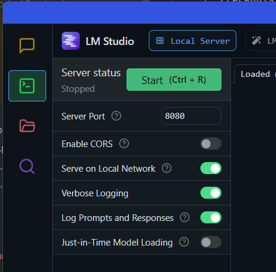

## Setting up the code and env
**1. Prerequisites**
   1. Python 3.13.x must be installed - [download](https://www.python.org/downloads/)
   2. LM Studio v0.3.5 must be installed - [release notes](https://lmstudio.ai/blog/lmstudio-v0.3.5)

**2. Check that Python has been installed correctly**
   1. Execute following command 
   ```shell
   python --version
   ```
   Output should look like below
   ```shell
   Python 3.13.0
   ```
   
**3. Setting up the LMStudio**

In order to use the LMStudio as a server navigate to Developer Mode.

Set up the port to 8080 (or other - in case that 8080 is used)



**4. Check that LMStudio can be run from commandline**

   ```shell
   lms
      __   __  ___  ______          ___        _______   ____
     / /  /  |/  / / __/ /___ _____/ (_)__    / ___/ /  /  _/
    / /__/ /|_/ / _\ \/ __/ // / _  / / _ \  / /__/ /___/ /
   /____/_/  /_/ /___/\__/\_,_/\_,_/_/\___/  \___/____/___/
   
   lms - LM Studio CLI - v0.0.28
   GitHub: https://github.com/lmstudio-ai/lmstudio-cli
   
   Usage
   lms <subcommand>
   
   where <subcommand> can be one of:
   
   - status - Prints the status of LM Studio
   - server - Commands for managing the local server
   - ls - List all downloaded models
   - ps - List all loaded models
   - get - Searching and downloading a model from online.
   - load - Load a model
   - unload - Unload a model
   - create - Create a new project with scaffolding
   - log - Log operations. Currently only supports streaming logs from LM Studio via `lms log stream`
   - import - Import a model file into LM Studio
   - bootstrap - Bootstrap the CLI
   - version - Prints the version of the CLI
   
   For more help, try running `lms <subcommand> --help`
   ```

**5. Clone the repository using git clone command:**

   ```shell
   git clone https://github.com/pwalaszkowski/msc_seminarium.git
   
   $ git clone https://github.com/pwalaszkowski/msc_seminarium.git
   Cloning into 'msc_seminarium'...
   remote: Enumerating objects: 51, done.
   remote: Counting objects: 100% (51/51), done.
   remote: Compressing objects: 100% (35/35), done.
   remote: Total 51 (delta 22), reused 41 (delta 12), pack-reused 0 (from 0)
   Receiving objects: 100% (51/51), 41.93 KiB | 1.50 MiB/s, done.
   Resolving deltas: 100% (22/22), done.
   ```

or download 

```shell 
https://github.com/pwalaszkowski/msc_seminarium/archive/refs/heads/master.zip
```

**6. Navigate to repository directory**

   1. Setup Python venv in current working directory
   ```shell
   python -m venv env
   ```
   2. Confirm that env is created (the directory env should exist)
   ```shell
   $ ls -la env/
   total 14
   drwxr-xr-x 1 pwala 197609   0 Dec 17 18:35 ./
   drwxr-xr-x 1 pwala 197609   0 Dec 17 18:35 ../
   -rw-r--r-- 1 pwala 197609  71 Dec 17 18:35 .gitignore
   drwxr-xr-x 1 pwala 197609   0 Dec 17 18:35 Include/
   drwxr-xr-x 1 pwala 197609   0 Dec 17 18:35 Lib/
   drwxr-xr-x 1 pwala 197609   0 Dec 17 18:35 Scripts/
   -rw-r--r-- 1 pwala 197609 337 Dec 17 18:35 pyvenv.cfg 
   ```
   3. Navigate to directory `env/Scripts`

   Activate virtual environment running the activate script
   ```shell
   ./activate.bat
   ```
   Under Linux machine the script will be called
   ```shell
   ./activate 
   ```
   4. The user prompt should now start with `(env)`
   
   ```shell
   (env) C:\Repositories\
   ```

7. Download required packages via pip

   ```shell
   python -m pip install -r requirements.txt
   ```
   
## Running prompts
1. Open LMStudio (do not run any prompts or download models)
2. Navigate to config.ini file to set the model, prompt and model paths under Windows 

   ```ini
   [DEFAULT]
   MODEL = qwen2-0.5b-instruct
   PROMPT = 'Create me a for loop in Python'
   MODEL_PATH = C:\Users\pwala\.cache\lm-studio\models
   ```
   
3. Run the lmstudio_wrapper.py
   ```shell
   python ./lmstudio_wrapper.py
   ```
   The wrapper will 
   1. launch the server
   2. Download model
   3. Load the model into LMStudio
   4. Send prompt to LMStudio
   5. Return answer on console
   6. Write the answer into `output` directory with following format
      `MODEL_YYYY_MM_DD_HH_MM_SS`
   7. The wrapper will eject the model
   8. The wrapper will remove the downloaded models
